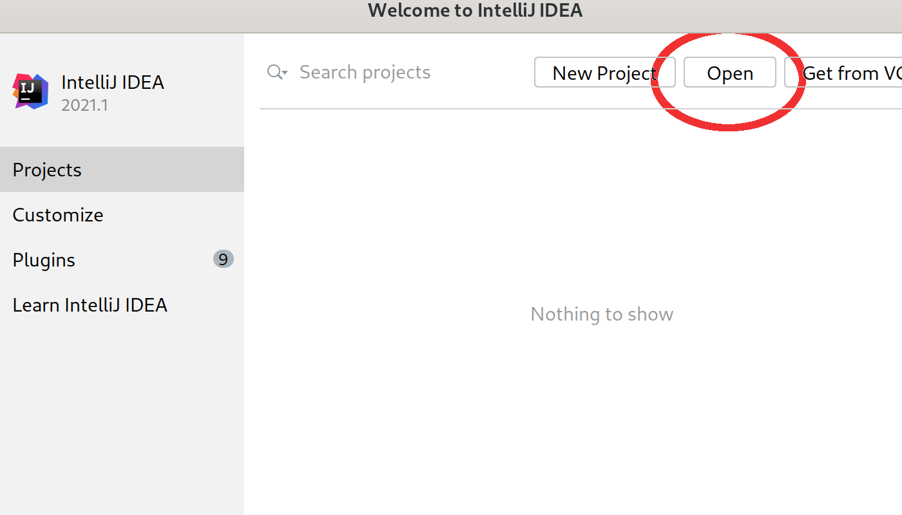
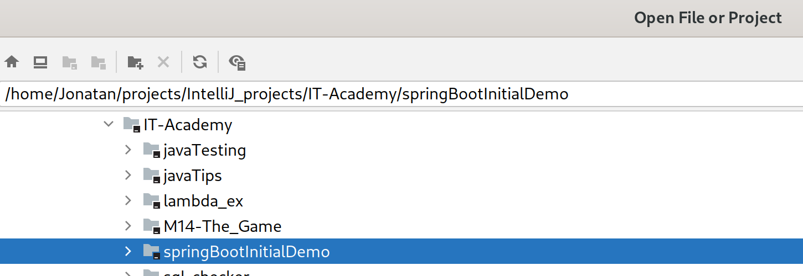
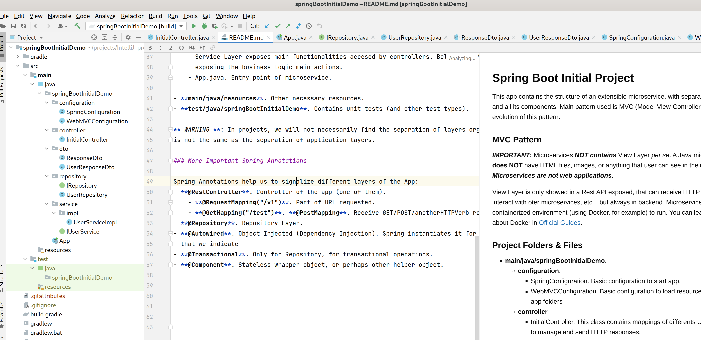
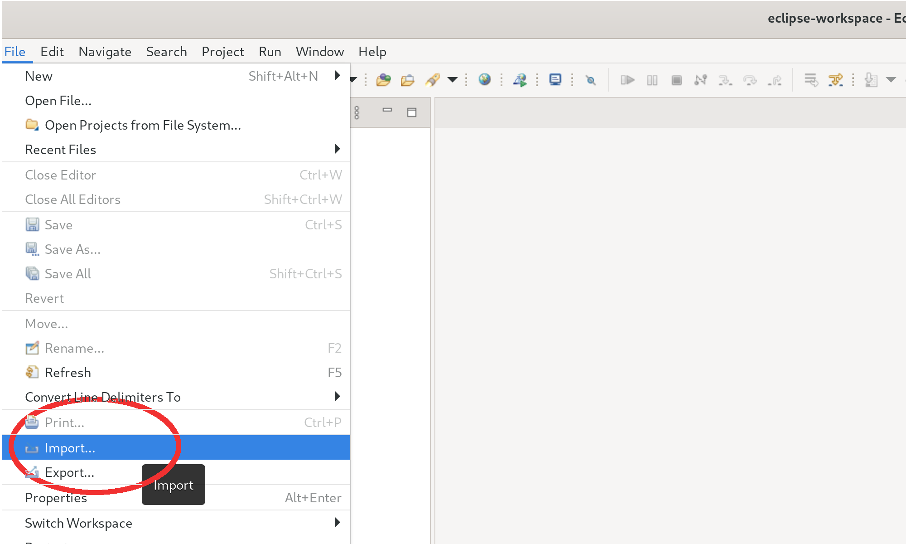
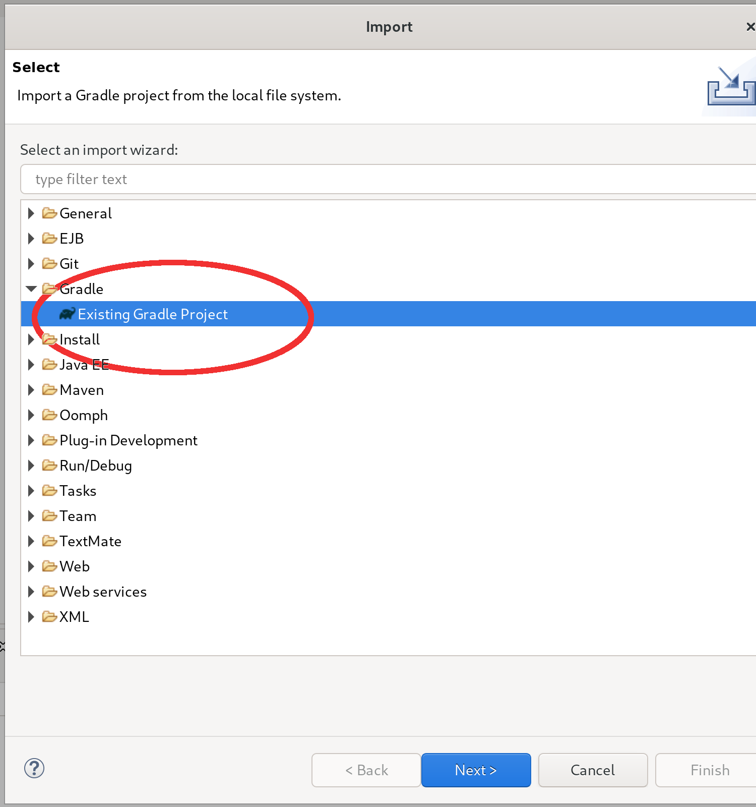
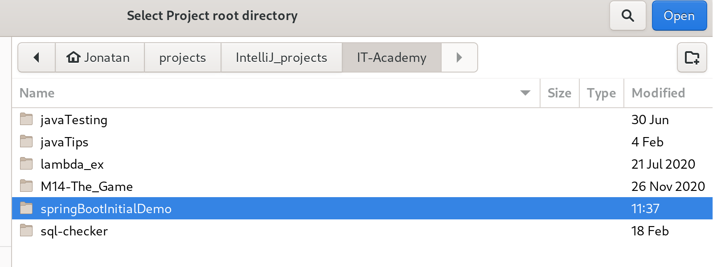
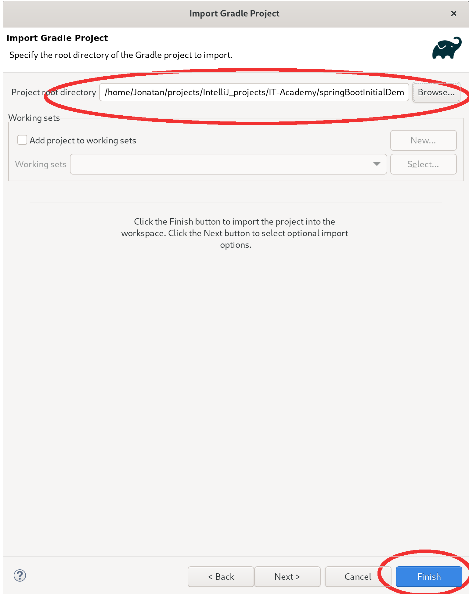
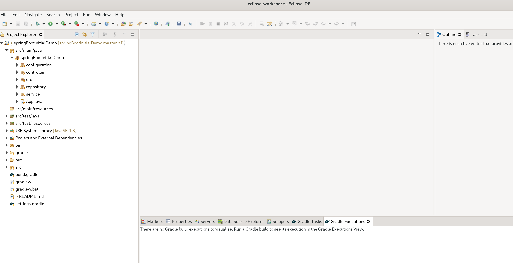

# javaTips Project

Modular Project with samples, demos and more ;)


#### Project Structure

This is a Gradle Modular Project.
Contains several modules that can be executed sequentially in one go, or individually. 

Folders structure is standard Java:
- **main** directory. Contains main code Java.
- **test** directory. Contains unit and other tests to test main code.
Both folders have same structure:
- **java**. With packages and classes Java.
- **resources**. Neccessary resources to execute, either main code or the tests.

You can see longer explanation of this topic or how organize
your Gradle projects in [Official Gradle Documentation](https://docs.gradle.org/current/userguide/organizing_gradle_projects.html)


#### Running the examples

You can run **all modules** executing Gradle **run** task, by command line or using your IDE.
By command-line, you have to execute:

- Linux / macOS
``` 
 ./gradlew run
```
- Windows
```
gradlew.bat run
```

You can run each module separately invocating:

- Linux / macOS
``` 
 ./gradlew :[moduleName]:run
```
- Windows
```
gradlew.bat :[moduleName]:run
```


## Modules

- <b>Callback Pattern</b>: Short demo of callback Pattern.
  - **Main**. Main class execute callback passing as parameter an object type IPaymentMethod. 
    This operation is similar to which the payment gateways run.
 
- <b>Properties</b>: Load an external file with properties. Access to system properties.
  - **Main**. Main class that loads properties file
  - **application.properties**. Properties file located in folder java/resources.
  
- <b>Bubble</b>: Bubble Sort Algorithm.
  - **Bubble sort**, sometimes referred to as sinking sort, is a simple sorting algorithm that 
   repeatedly steps through the list, compares adjacent elements and swaps them if they are in 
   the wrong order. The pass through the list is repeated until the list is sorted. 
   The algorithm, which is a comparison sort, is named for the way smaller or larger elements "bubble" 
   to the top of the list.
   - **Main**. Shows Bubble Sort, equivalent to invoking the _Collections.Sort_ method (see 
     [Official Docs](https://docs.oracle.com/en/java/javase/11/docs/api/java.base/java/util/Collections.html) for
     more details.
     
- <b>Streams</b>: 
    - Java8 introduced functional programming, with **Streams** and others.
    - **StreamBasic** class shows how how to use streams to make comparisons, go through lists in a minimalist and 
      effective code. See _getLowCaloricDishesNamesInJava8()_ method.

- <b>Lambdas</b>: 
    - This module contains a short demo how to use lambdas, powerful java functions for filtering and execution.
    See _Lambdas.java_.

- <b>Reflection</b>: Contains a demo of API Reflection uses. Reflection allows us to access internal properties 
  of Java objects without knowing their definition.
  You can see how at Main.class

- <b>Inner Classes</b>:Although they need to be used wisely, inner classes also allow many possibilities

- <b>Enumerations</b>: Introduced in Java5
  
- <b>Restaurant</b>: Java has been designed to support concurrent programming, and all execution takes place
  in the context of threads. Objects and resources can be accessed by many separate threads; 
  each thread has its own path of execution but can potentially access any object in the program. 
  The programmer must ensure read and write access to objects is properly coordinated (or "synchronized") 
  between threads. Thread synchronization ensures that objects are modified by only one thread at a time and 
  that threads are prevented from accessing partially updated objects during modification by another thread. 
  The Java language has built-in constructs to support this coordination.
  - This sample is a demo of Consumer-Producer Threads.

- <b>Polymorphism</b>: Polymorphism and inheritance are some of the great benefits of OOP. This folder contains a brief
  example, see the main in _Music2.java_.

- <b>RegExp</b>: Regular Expressions in Java Language.
  
- <b>OneToOne</b>: This example shows a One-To-One relationship using JPA (see [README.md](OneToOne/README.md)). 
    - This sample contains a microservice, similar to project [SpringBootInitialDemo](https://github.com/IT-Academy-BCN/springBootInitialDemo).
    - The code shows how to set up and implement a relationship One-2-One. Uses a in-memory database H2, as you can see at application.properties.
    - System load when starting files schema.sql and data.sql, in that order, creating a db navigable at http://localhost:8081/h2-console
    - Pay special attention at the entities: Student and Tuition. Show how to map database entities to Java objects.
  
- <b>Optional</b>: 
    - Java 8 introduced the class **Optional**.
    - The purpose of this class is to provide a type-level solution for representing optional values instead of null references, avoid
    NullPointerException.
      

- **JacksonMapper**. This demo contains Jackson uses to serialize/deserialize JSON objects.
    - Visit [Baeldung Tutorial](https://www.baeldung.com/jackson-object-mapper-tutorial) for more use cases.
    - You can find more examples at [Baeldung Tutorials]())     

**Note**: Some examples are adaptations of course **Thinking In Java** of Bruce Eckel. You can see more examples [here](https://www.mindviewinc.com/)  

### Import project to IntelliJ

Follow next steps:
- Open IntelliJ.
  

- Select **Open** option.
  

- Navigate to the folder containing the project.
  

### Import project to Eclipse
- Navigate to menu File > Import
  

- Select Gradle / Existing Gradle Project and press 'Next'
  

- Select Project Root Directory as images below shown, and press 'Finish'
  



- Now you can see the workspace with the project ready to work
  


[](code_of_conduct_EN.md) 
 [](code_of_conduct_ES.md) 
  [](code_of_conduct_CA.md) 
